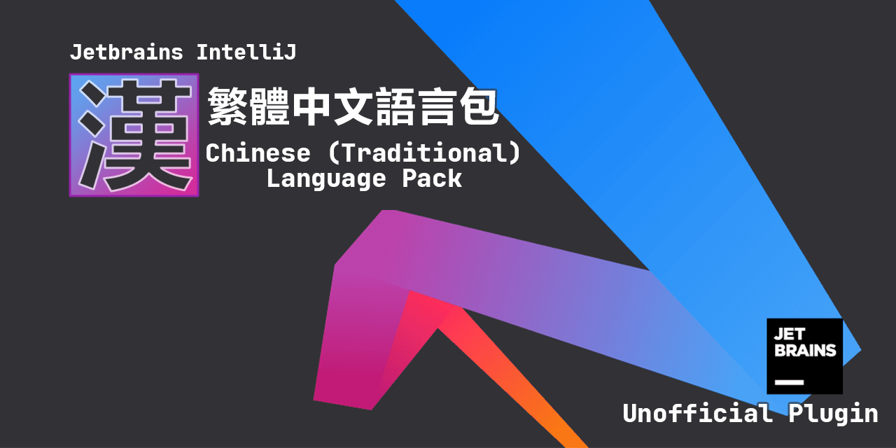
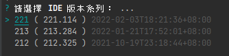
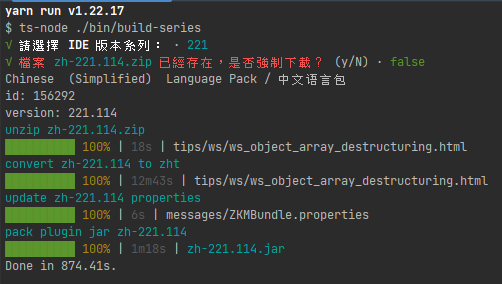
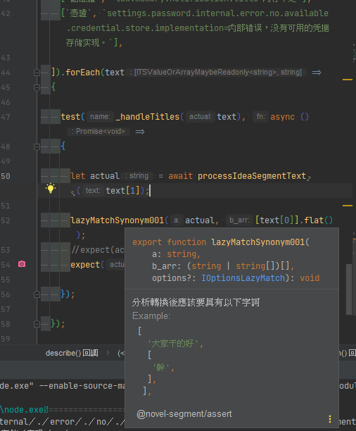
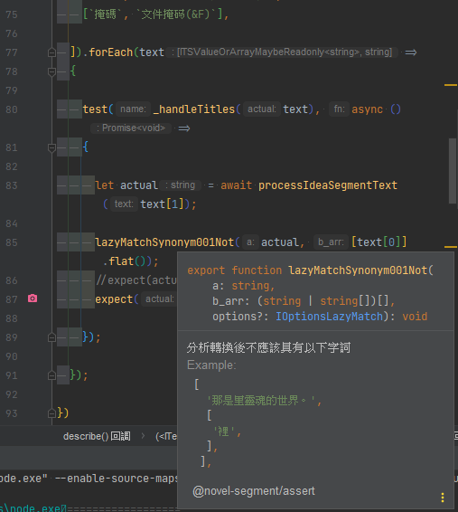
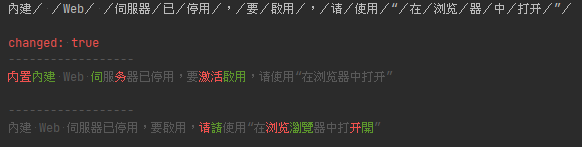

# README.md

    Jetbrains IntelliJ Chinese (Traditional) Language Pack / 繁體中文語言包

The Chinese Language Pack localizes the UI of IntelliJ IDEA, AppCode, CLion, DataGrip, GoLand, PyCharm, PhpStorm, RubyMine, and WebStorm into Chinese.

中文語言包將為您的 IntelliJ IDEA, AppCode, CLion, DataGrip, GoLand, PyCharm, PhpStorm, RubyMine, 和WebStorm 帶來中文化的界面。

## install

- install from [GitHub](https://github.com/bluelovers/idea-l10n-zht/raw/master/plugin-dev-out/zh.jar) (推薦安裝此版本來得到最新版本)
- install from [jetbrains:com.intellij.zh-tw](https://plugins.jetbrains.com/plugin/18365-chinese-traditional-language-pack-----) or [jetbrains:sc.plugin.com.intellij.zh-tw](https://plugins.jetbrains.com/plugin/18574-chinese-traditional-language-pack-----)

> 注意：請先移除或禁用[官方簡體中文語言包](https://plugins.jetbrains.com/plugin/13710-chinese-simplified-language-pack----)

### 其他發行版

- [GitHub Tags](https://github.com/bluelovers/idea-l10n-zht/tags)

- 或執行 `yarn run plugin:series:build` 即可以最新版的打包程式來自行選擇要打包哪一個版本系列

## dev

1. 執行 `yarn run ci:git:config`

2. 請額外自行安裝 typescript@next jest ts-jest ts-node ynpx lerna yarn-tool  
  或執行 `yarn run ci:install`

### 與官方簡體版差異

- 以分詞系統與轉繁來基於官方簡體版自動打包製作
- 解除版本安裝上限範圍的限制 *until-build*
- 忽略部分官方版檔案
- 部分翻譯差異統一化
- [需使用自訂 plugin repo 才能夠在版本編號變化時得到更新](https://github.com/bluelovers/idea-l10n-zht/discussions/25)

### Git Commit Message Convention

- 提交 git 訊息時可參考 [Git Commit Message Convention](.github/commit-convention.md)

### 基於分詞系統的替換字詞說明

#### [lib/static/synonym.txt](lib/static/synonym.txt)

此檔案放置轉換用詞，格式為 `最終顯示的字詞,替换的原始简体字词`

然後由於每次轉換都是以原始簡體檔案來做轉換，所以替換的字詞請包含簡體

實際添加的內容請直接查看檔案內容做參考

#### [lib/static/table.txt](lib/static/table.txt)

此檔案放置分詞系統的字典庫

請參考 

- https://github.com/bluelovers/ws-segment/blob/master/packages/%40novel-segment/postag/lib/postag/ids.ts
- https://github.com/bluelovers/ws-segment/blob/master/packages/novel-segment/test/demo.cache.ts#L97

#### [test/segment.spec.ts](test/segment.spec.ts)

新增字典或轉換規則後，推薦編輯此檔案，來檢查是否正確轉換或者發生誤轉換  
盡量以容易發生誤轉換的文字來做為首選測試

#### [test/segment-check.ts](test/segment-check.ts)

在 [test/temp/*.txt](test/temp) 資料夾底下新增任何副檔名為 .txt 檔案後  
執行此腳本 則可以查看分詞系統分詞後結果  
來了解 為什麼沒有發生預期的轉換

**_此檔案也能作為比執行測試更快知道轉換與分詞結果_**

### .properties

透過 [lib/static/lazy.properties](lib/static/lazy.properties) 可無視分詞轉換結果直接取代內容

### 其他

有部分無法透過分詞系統來轉換的則可以透過編輯以下檔案來完善

- [lib/segment.ts](lib/segment.ts)
- [lib/handleText.ts](lib/handleText.ts)

- [OBFUSCATE 混淆與曖昧](OBFUSCATE.md) 此檔案放置需要確認或討論的項目

## TODO

- ~~自動偵測抓取原版簡體最新下載網址~~
- 偵測檢查 zip / git / 檔案系統 上的檔案 是否存在大小寫不同的同名檔案
- ~~可指定編譯基於指定版本的語言包~~
- 同時更新多個版本的語言包
- ~~偵測檢查可能包含未翻譯內容的檔案與鍵值~~

## 已知問題

- `dot-properties-loader` 會將 `label.inactive.timeout.sec= 秒` 轉換為 `label.inactive.timeout.sec=秒` 對於 IDEA 的實際影響則不清楚，照一般來說等號後的空白應該是不會被當作內容值
- 如果 git 發現詭異的檔案永遠都是變動狀態的話 請檢查是否存在與此 BUG 相同的問題  
  https://youtrack.jetbrains.com/issue/IDEA-288057
- 由於是跟隨官方簡體版更新，所以最新版的通常只支援最新版本或 EAP 版本的 IDE  
  如果有其他版本需要安裝請參考 README.md 內的 Other Releases

## 參考資料或其他

- [Intellij 和 Android Studio 介面設定 繁體中文 漢化 套件(附安裝教學)](https://www.ruyut.com/2022/01/Chinese-Traditional.html)

---

- [英中繁簡編程術語對照](https://www.limoritakeu.tech/2017/11/20/translation-terms/)
- https://github.com/pjchender/cn2tw4programmer/tree/master/src/terms
- [《Pro Git》第二版中文文件翻譯對照表與規範](https://gist.github.com/fntsrlike/cf1e96d60b6f34fab725599b06dfcb2a)
- [VSCode 繁體中文語言包](https://github.com/microsoft/vscode-loc/blob/main/i18n/vscode-language-pack-zh-hant/translations/main.i18n.json)
- [GitKraken 正體中文 (台灣) 翻譯](https://github.com/rogeraabbccdd/GitKraken-zh-tw)

